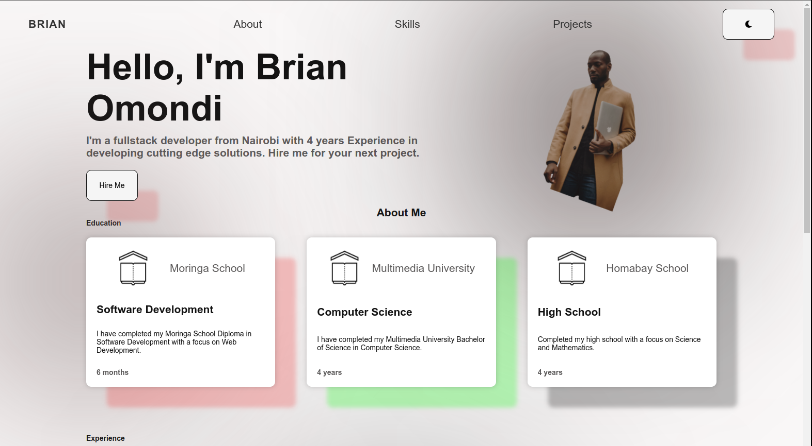

# Portfoliox

### (Personal portfolio website)

- [Description](#overall-project-description)
- [Setup instructions](#setup-instructions)
- [Technology Used](#languages-and-frameworks)
- [Licence](#Licence)
- [Authors Info](#Author)

## Overall Project Description

- This is a portfolio website for a Moringa School project.

#

#### Final Project Preview

     

## Languages and Frameworks

- Html5
- Css3
- JavaScript

## Known Bugs

- Currently not aware of any. Open to project improvement suggestions.

## Contributing

Contributions to the project are welcome. Fork this repo to contribute.

## Setup instructions

HTTPS: `git clone https://github.com/bryanbill/portfoliox.git`

SSH: `git clone git@github.com:bryanbill/portfoliox.git`

## Live Site

#### Available Here: (https://bryanbill.github.io/portfoliox)

## Licence

[MIT LICENCE](LICENSE)

## Author

- [Brian Omondi](https://github.com/bryanbill)
